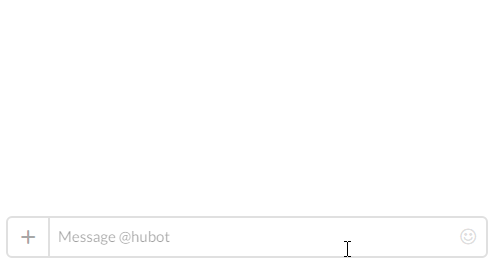
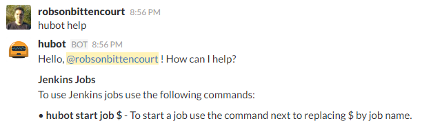
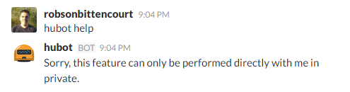

# gear-help
[](https://travis-ci.org/hubot-js/gear-help)  [](https://www.npmjs.com/package/gear-help)   [](https://coveralls.io/github/hubot-js/gear-help?branch=master)   [](https://codeclimate.com/github/hubot-js/gear-help)  [](https://david-dm.org/hubot-js/gear-help)  [](https://david-dm.org/hubot-js/gear-help?type=dev)

> A Hubot Gear for enable help and show available commands 

This is a gear to add to [hubot.js](https://github.com/hubot-js/hubot.js) the ability to show help with available commands. If you do not know the hubot.js or do not know what they are gears like this [click here](https://github.com/hubot-js/hubot.js/blob/master/README.md) for more details.



## Usage

When hubot.js starts you can ask for help. The help command will show commands from all active gears.

```
hubot help
```



Help should be asked directly to the hubot. If you ask help in channel, will receive a warning.



## Development setup
- Fork and clone this project
- In the main directory run ```npm install```to install dependencies.
- Write your code.
- To run tests use ```npm test``` command

## Meta
Robson Bittencourt - @rluizv - robson.luizv@gmail.com

Distributed under the MIT license. See [LICENSE](LICENSE) for more information.

https://github.com/hubot-js/gear-help
